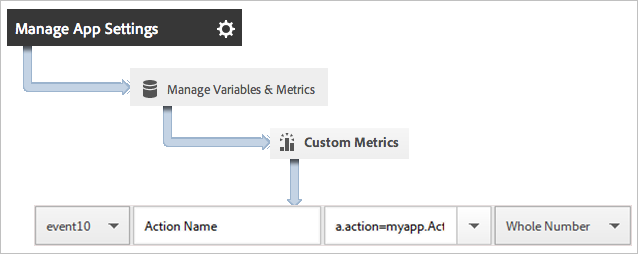
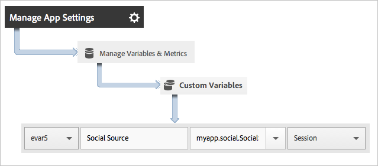

# Track App Actions {#track-app-actions}

Actions are the events that occur in your Android app that you want to measure.

Each action has one or more corresponding metrics that are incremented each time the event occurs. For example, you might send a `trackAction` call for each new subscription, each time an article is viewed, or each time a level is completed. Actions are not tracked automatically, so you must call `trackAction` when an event that you want to track occurs, and map the action to a custom event.

## Tracking Actions {#section_380DF56C4EE4432A823940E4AE4C9E91}

1. Add the library to your project and implement lifecycle.
   For more information, see *Add the SDK and Config File to your IntelliJ IDEA or Eclipse Project* in [Core implementation and lifecycle](/help/android/getting-started/dev-qs.md).
1. Import the library: 

   ```java
   import com.adobe.mobile.*;
   ```

1. When the action that you want to track occurs in your app, call `trackAction` to send a hit for this action: 

   ```java
   Analytics.trackAction("myapp.ActionName", null);
   ```

1. In the Adobe Mobile Services UI, select your app and click **[!UICONTROL Manage App Settings]**. 
1. Click **[!UICONTROL Manage Variables and Metrics]** and click the **[!UICONTROL Custom Metrics]** tab. 

1. Map the context data name that is defined in your code, for example, `myapp.ActionName`, to a custom event.

   

You can also set a prop to hold all action values by mapping a custom prop with a name like **[!UICONTROL Custom Actions]** and setting the value to `a.action`.


## Sending Additional Data {#section_3EBE813E54A24F6FB669B2478B5661F9}

In addition to the action name, you can send additional context data with each track action call:

```java
HashMap<String, Object> exampleContextData = new HashMap<String, Object>(); 
exampleContextData.put("myapp.social.SocialSource", "Twitter"); 
Analytics.trackAction("myapp.SocialShare", exampleContextData);
```

Context data values must be mapped to custom variables in Adobe Mobile services:



## Action Reporting {#section_0F6A54AB7A3F42C9BB042D86A0FC4630}

| Interface | Report |
|--- |--- |
|Adobe Mobile Services|**[!UICONTROL Action Paths]** report.  View the order in which actions occur in your app. You can also click **[! UICONTROL Customize]**  on any report to view actions ranked, trended, or in a breakdown report or apply a filter to view actions for a specific segment.|
|Marketing reports & analytics|**[!UICONTROL Custom Event]** report.  After an action is mapped to a custom event, you can view mobile events similar to all other Analytics events.|
|Ad hoc analytics|**[!UICONTROL Custom Event]** report.  After an action is mapped to a custom event, you can view mobile events similar to all other Analytics events.|

