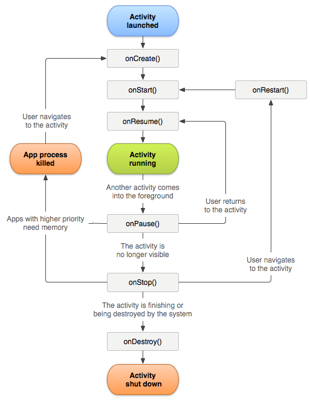

# Track App Crashes {#track-app-crashes}

This information helps you understand how crashes are tracked and the best practices to handle false crashes.

>[!TIP] 
>
>App crashes are tracked as part of lifecycle metrics. Before you can track crashes, add the [library to your project and implement lifecycle](/help/android/getting-started/dev-qs.md).

When lifecycle metrics are implemented, a call is made to `Config.collectLifecycleData` in the `OnResume` method of each activity. In the `onPause` method, a call is made to `Config.pauseCollectingLifeCycleData`.

In the `pauseCollectingLifeCycleData`, a flag is set to indicate a graceful exit. When the app is launched again or resumed, `collectLifecycleData` checks this flag. If the app did not exit successfully as determined by the flag status, an `a.CrashEvent` context data is sent with the next call and a crash event is reported.

To ensure accurate crash reporting, you must call `pauseCollectingLifeCycleData` in the `onPause` method of each activity. To understand why this is essential, here is an illustration of the Android activity lifecycle: 



For more information about the Android activity lifecycle, see [Activities](https://developer.android.com/guide/components/activities.html).

*This Android lifecycle illustration was created and [shared by the Android Open Source Project](https://source.android.com/) and used according to terms in the [Creative Commons 2.5 Attribution License](https://creativecommons.org/licenses/by/2.5/).*

**What can cause a false crash to be reported?**

1. If you are debugging by using an IDE, such as Android Studio, and launching the app again from the IDE while the app is in the foreground causes a crash.

   >[!TIP]
   >
   >You can avoid this crash by backgrounding the app before launching again from the IDE.

1. If the last foreground Activity of your app is backgrounded and does not call `Config.pauseCollectingLifecycleData();` in `onPause`, and your app is manually closed or killed by the OS, the next launch results in a crash.

**How should Fragments be handled?**

Fragments have application lifecycle events that are similar to Activities. However, a Fragment cannot be active without being attached to an Activity.

>[!IMPORTANT]
>
>You need to rely on the lifecycle events against which the containing activities can run your code. This will be handled by the parent view of the Fragment.

**(Optional) Implement Activity lifecycle callbacks**

Starting with API Level 14, Android allows global lifecycle callbacks for activities. For more information, see [Application](https://developer.android.com/reference/android/app/Application).

You can use these callbacks to ensure that all of your Activities correctly call `collectLifecycleData()` and `pauseCollectingLifecycleData()`. You need to add this code only in your main Activity and any other Activity in which your app may be launched:

```js
import com.adobe.mobile.Config; 
  
public class MainActivity extends Activity { 
... 
    @Override 
    protected void onCreate(Bundle savedInstanceState) { 
        super.onCreate(savedInstanceState); 
        setContentView(R.layout.activity_main); 
  
        getApplication().registerActivityLifecycleCallbacks(new Application.ActivityLifecycleCallbacks() { 
            @Override 
            public void onActivityResumed(Activity activity) { 
                Config.setContext(activity.getApplicationContext()); 
                Config.collectLifecycleData(activity); 
            } 
  
            @Override 
            public void onActivityPaused(Activity activity) {     
                Config.pauseCollectingLifecycleData(); 
            } 
    
            // the following methods aren't needed for our lifecycle purposes, but are required to be implemented 
            // by the ActivityLifecycleCallbacks object 
            @Override 
            public void onActivityCreated(Activity activity, Bundle savedInstanceState) {} 
            @Override 
            public void onActivityStarted(Activity activity) {} 
            @Override 
            public void onActivityStopped(Activity activity) {} 
            @Override 
            public void onActivitySaveInstanceState(Activity activity, Bundle outState) {} 
            @Override 
            public void onActivityDestroyed(Activity activity) {} 
        }); 
    } 
... 
}
```

To send additional context data with your lifecycle call by using `Config.collectLifecycleData(Activity activity`, `Map<String`, `Object> contextData)`, you must override the `onResume` method for that Activity and ensure that you call `super.onResume()` after manually calling `collectLifecycleData`.

```js
@Override 
protected void onResume() { 
    HashMap<String, Object> cdata = new HashMap<>(); 
    cdata.put("someKey", "someValue"); 
    Config.collectLifecycleData(this, cdata); 
  
    super.onResume(); 
}
```

