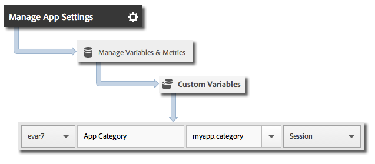

# Core implementation and lifecycle {#core-implementation-and-lifecycle}

This information helps you implement the Android library and collect lifecycle metrics, such as launches, upgrades, sessions, engaged users, and so on.

## Download the SDK {#section_99FE1A17A36D4A2C943939023CF6265C}

>[!IMPORTANT]
>
>To download the SDK, you must use Android 2.2 or later.

1. Complete the steps in the following sections to set up a development report suite and download a pre-populated version of the configuration file:

    * [Create a Report Suite](/help/android/getting-started/requirements.md) 
    * [Download the SDK](/help/android/getting-started/requirements.md)

1. Download and unzip the `[Your_App_Name_]AdobeMobileLibrary-4.*-Android.zip` file and verify that the following software components exist:

    * `adobeMobileLibrary.jar`, which is the library that will be used with Android devices and simulators. 

    * `ADBMobileConfig.json`, which is the SDK configuration file that is customized for your app.

    >[!IMPORTANT]
    >
    >If you download the SDK outside the Adobe Mobile services UI, the `ADBMobileConfig.json` file must be manually configured. If you are new to Analytics and the Mobile SDK, and you want to set up a development report suite and download a pre-populated version of the configuration file, see [Before You Start](/help/android/getting-started/requirements.md).

## Add the SDK and config file to your IntelliJ IDEA or Eclipse project {#section_B89510FBB4C646AEA73A185B966E54D3}

**IntelliJ IDEA project**

To add the SDK and config file to your project:

1. Add the `ADBMobileConfig.json` file to the `assets` folder in your project. 

1. Right click your project in the project navigation panel. 
1. Select **[!UICONTROL Open Module Settings]**. 
1. Under **[!UICONTROL Project Settings]**, select **[!UICONTROL Libraries]**. 
1. Click the **[!UICONTROL +]** icon to add a new library. 
1. Select **[!UICONTROL Java]** and navigate to the `adobeMobileLibrary.jar` file. 
1. Select the modules where you plan to use the mobile library. 
1. Click **[!UICONTROL Apply]** and **[!UICONTROL OK]** to close the Module Settings window.

**Eclipse project**

To add the SDK and config file to your project:

1. Add the `ADBMobileConfig.json` file to the `assets` folder in your project. 
1. In **[!UICONTROL Eclipse IDE]**, right-click the project name. 
1. Click  **[!UICONTROL Build Path]** > **[!UICONTROL Add External Archives]**. 
1. Select `adobeMobileLibrary.jar`. 
1. Click **[!UICONTROL Open]**. 
1. Right-click the project again and select **[!UICONTROL Build Path]** > **[!UICONTROL Configure Build Path]**. 
1. On the **[!UICONTROL Order and Export]** tab, ensure that **`adobeMobileLibrary.jar`** is selected.

## Add app permissions {#section_2EAF73ABF6424647B219A63B33B02CD5}

The AppMeasurement Library requires the following permissions to send data and record offline tracking calls:

* `INTERNET` 
* `ACCESS_NETWORK_STATE`

To add these permissions, add the following lines to your `AndroidManifest.xml` file, which is located in the application project directory:

```java
<uses-permission android:name="android.permission.INTERNET" /> 
<uses-permission android:name="android.permission.ACCESS_NETWORK_STATE" />
```

## Set the application context {#set-application-context}

The following code should be added in the `onCreate` method of your main activity:

```java
   @Override
   public void onCreate(BundlesavedInstanceState){
     super.onCreate(savedInstanceState)
     setContentView(R.layout.main);
     Config.setContext(this.getApplicationContext());
   }
```

## Implement lifecycle metrics {#section_BA686C09021F474AADDE8690BBB910F7}

After you enable lifecycle, each time your app is launched, one hit is sent to measure launches, upgrades, sessions, engaged users, and many other metrics. For more information, see [Lifecycle Metrics](/help/android/metrics.md).

**Complete the following steps in each activity of your application:**

1. Import the library: 

   ```java
   import com.adobe.mobile.*;
   ```

1. In the `onResume` function, start the lifecycle data collection: 

   ```java
   @Override 
   public void onResume() { 
       Config.collectLifecycleData(this); 
       // -or- Config.collectLifecycleData(this, contextData); 
   }
   ```

1. In the `onPause` function, pause the lifecycle data collection: 

   ```java
   @Override 
   public void onPause() { 
       Config.pauseCollectingLifecycleData(); 
   }
   ```

>[!IMPORTANT]
>
>You must add these calls to every activity to ensure accurate crash reporting. For more information, see [Track App Crashes](/help/android/analytics-main/crashes.md).

## Include additional data with lifecycle calls

To include additional data with lifecycle metric calls, pass an additional parameter to `collectLifecycleData` that contains context data:

```java
@Override 
public void onResume() {
    HashMap<String, Object> contextData = new HashMap<String, Object>(); 
    contextData.put("myapp.category", "Game"); 
    Config.collectLifecycleData(this, contextData); 
}
```

Additional context data values that are sent with `collectLifecycleData` must be mapped to custom variables in Adobe Mobile services: 



Other lifecycle metrics are collected automatically. For more information, see [Lifecycle Metrics](/help/android/metrics.md).

## What to do next {#section_BF709684E1DD40EA9169BC1D0D4B37C2}

Complete the following tasks:

* [Track App States](/help/android/analytics-main/states.md) 
* [Track App Actions](/help/android/analytics-main/actions.md)
