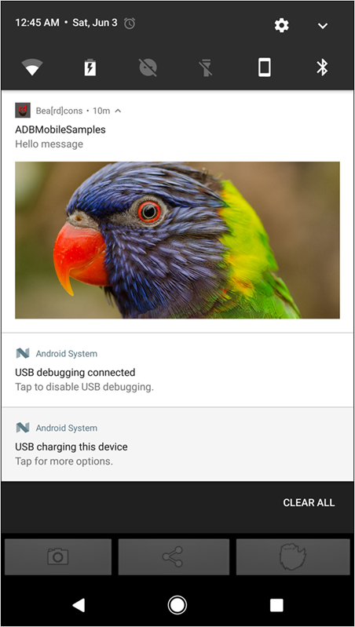

# Receive rich push notifications {#receive-rich-push-notifications}

You can attach image files to your Android notifications. Adding visual components can significantly increase your user's engagement with push notifications.

## Handle the incoming rich push message (FCM) {#section_AF1A3BC2312C4E1DA517CC90296C11E2}

If the app is in the foreground, the push message will be handled by the app that extends the `FirebaseMessagingService` class and is declared in the manifest file in the following way: 

```java
<service
    android:name=".MyFirebaseMessagingService"
    android:exported="false">
    <intent-filter>
        <action android:name="com.google.firebase.MESSAGING_EVENT" />
    </intent-filter>
</service>
```

>[!IMPORTANT]
>
>The class that contains the `onMessageReceived()` implementation handles the data that is received.

If the push message contains a Media URL, the URL will be available in the `RemoteMessage` parameter that is passed to the `onMessageReceived()` function. The key to be used is `attachment-url` as shown in the following code sample: 

```java
public class MyFirebaseMessagingService extends FirebaseMessagingService {
        @Override
        public void onMessageReceived(RemoteMessage remoteMessage) {
      Log.d("Remote Message", "RemoteMessage: " + remoteMessage.toString());
            // Check if message contains a data payload.
            if (remoteMessage.getData().size() > 0) {
                Log.d("Remote Message", "RemoteMessage: " + remoteMessage.getData());
                sendNotification(remoteMessage);
            }
    }
 
private void sendNotification(RemoteMessage message) {
        Intent intent = new Intent(this, MainActivity.class);
    intent.addFlags(Intent.FLAG_ACTIVITY_CLEAR_TOP);
    PendingIntent pendingIntent = PendingIntent.getActivity(this, 0 /* Request code */, intent, PendingIntent.FLAG_ONE_SHOT);

     String channelId = getString(R.string.default_notification_channel_id);
     Uri defaultSoundUri = RingtoneManager.getDefaultUri(RingtoneManager.TYPE_NOTIFICATION);
     NotificationCompat.Builder notificationBuilder =
                new NotificationCompat.Builder(this, channelId)
                        .setSmallIcon(R.drawable.ic_stat_ic_notification)
                        .setContentTitle(getString(R.string.fcm_message))
                        .setContentText(message.getData().get("body"))
                        .setAutoCancel(true)
                        .setSound(defaultSoundUri)
                        .setContentIntent(pendingIntent);
  
    //Handle image url if present in the push message 
        String attachmentUrl = message.getData().get("attachment-url");
  
    if (attachmentUrl != null) { 
    Bitmap image = getBitmapFromURL(attachmentUrl); 
    if (image != null) { 
      notificationBuilder.setStyle(new        NotificationCompat.BigPictureStyle().bigPicture(image)); 
        } 
        } 

     NotificationManager notificationManager =
              (NotificationManager) getSystemService(Context.NOTIFICATION_SERVICE);

     // Since android Oreo notification channel is needed.
     if (Build.VERSION.SDK_INT >= Build.VERSION_CODES.O) {
        NotificationChannel channel = new NotificationChannel(channelId,
                    "Channel human readable title",
                    NotificationManager.IMPORTANCE_DEFAULT);
            notificationManager.createNotificationChannel(channel);
     }

     notificationManager.notify(0 /* ID of notification */, notificationBuilder.build());
    }
}
```

>[!IMPORTANT]
>
>When you set `NotificationCompat.BigPictureStyle`, large images might not be displayed. To ensure that large images are always displayed, set the native `Notification.BigPictureStyle`.

## Sample rich push notification {#section_6819316BEDDE45108413B541CA2BB2DC}

Here is an example of a rich push notification with an image:



For more information about rich push notifications with Android, see [Engage with Rich Notifications](https://developer.android.com/distribute/best-practices/engage/rich-notifications.html).
