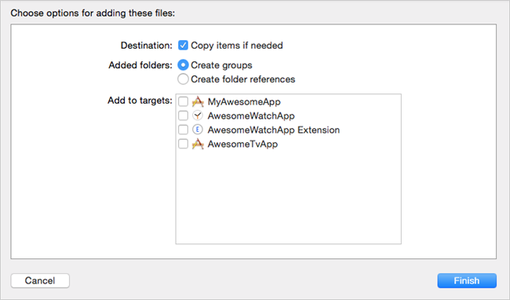

# Core Implementation and Lifecycle{#core-implementation-and-lifecycle}

This information helps you implement the iOS library and collect lifecycle metrics, such as launches, upgrades, sessions, engaged users, and so on.

## Download the SDK {#section_99FE1A17A36D4A2C943939023CF6265C}

>[!IMPORTANT]
>
>To download the SDKs, you must use iOS 6 or later.

1. Complete the steps in [Create a Report Suite](../getting-started/requirements.md#section_7BC602ED1ABA42C6AB722F506B5219F3) to set up a development report suite and download a pre-populated version of the configuration file. 
1. Download, unzip the `[Your_App_Name_]AdobeMobileLibrary-4.*-iOS.zip` file, and verify that you have the following software components:

    * `ADBMobile.h`, the Objective-C header file that is used for iOS AppMeasurement. 
    * `ADBMobileConfig.json`, the SDK configuration file that is customized for your app. 
    * `AdobeMobileLibrary.a`, a bitcode-enabled fat binary that contains the library builds for iOS devices (armv7, armv7s, arm64) and simulators (i386, x86_64).

      This fat binary should be linked when the target is intended for an iOS app. 
    
    * `AdobeMobileLibrary_Extension.a`, a bitcode-enabled fat binary that contains the library builds for iOS devices (armv7, armv7s, arm64) and simulators (i386, x86_64).

      This fat binary should be linked when the target is intended for an iOS extension. 
    
    * `AdobeMobileLibrary_Watch.a`, a bitcode-enabled fat binary that contains the library builds for Apple Watch devices (armv7k) and simulators (i386, x86_64).

      This fat binary should be linked when the target is intended for an Apple Watch (watchOS 2) extension app. 
    
    * `AdobeMobileLibrary_TV.a`, a bitcode-enabled fat binary that contains the library builds for new Apple TV devices (arm64) and simulator (x86_64).

      This fat binary should be linked when target is intended for an Apple TV (tvOS) app.

>[!IMPORTANT]
>
>If you download the SDK outside the Adobe Mobile services UI, the `ADBMobileConfig.json` must be manually configured. If you are new to Analytics and the Mobile SDK, see [Before You Start](../getting-started/requirements.md#concept_2FA4E790CA1646FFB44488CF017821DE) to set up a development report suite and download a pre-populated version of the configuration file.

## Add the SDK and Config File to your Project {#section_93C25D893B4A4CD3B996CF3C5590C8DC}

1. Launch the Xcode IDE and open your app. 
1. In [!DNL Project Navigator], drag the `AdobeMobileLibrary` folder and drop it under your project . 
1. Verify the following:

    * The **[!UICONTROL Copy Items if needed]** checkbox is selected. 
    * **[!UICONTROL Create groups]** is selected. 
    * None of the checkboxes in the **[!UICONTROL Add to targets]** section is selected.

   

1. Click **[!UICONTROL Finish]**. 
1. In [!DNL Project Navigator], select [!DNL ADBMobileConfig.json]. 
1. In [!DNL File Inspector], add the JSON file to any targets in your project that will use the Adobe SDK.

   

1. In [!DNL Project Navigator], complete the following steps:

    1. Click on your app. 
    1. On the **[!UICONTROL General]** tab, select your targets and link the required frameworks and libraries in the **[!UICONTROL Linked Frameworks]** and **[!UICONTROL Libraries]** sections.

    * **iOS App Targets**

    <table id="table_E5E0850AD1594D2ABB92F4329E5626C1"> 
    <tbody> 
    <tr> 
    <td colname="col1"> 
        <ul id="ul_C8E220AEF15145659DDCAE41CFC23929"> 
        <li id="li_DFAC3B19E69F4EE4A4FE24F9D5DD4F2F"> <span class="filepath"> SystemConfiguration.framework </span> </li> 
        <li id="li_DA0DF984C2694DCC848C85755603AA64"> <span class="filepath"> libsqlite3.0.tbd </span> </li> 
        <li id="li_2E4C38802BE44121B5627BA33AE11BAB"> <span class="filepath"> AdobeMobileLibrary.a </span> </li> 
        </ul> </td> 
    <td colname="col2"> <p style="text-align: center;">  </p> </td> 
    </tr> 
    </tbody> 
    </table>

    * **iOS Extension Target**

    <table id="table_29E09B34E6864460B6F6F5D231F48113"> 
    <tbody> 
    <tr> 
    <td colname="col1"> 
        <ul id="ul_4E9696FA12D64C9AA94747806956D7BE"> 
        <li id="li_A49F5E211DCC4B54B52E3C454C088E9F"> <span class="filepath"> SystemConfiguration.framework </span> </li> 
        <li id="li_57174162080A40B1969B2E53568F8684"> <span class="filepath"> libsqlite3.0.tbd </span> </li> 
        <li id="li_62E5A48836FB4842B8E54CEFFE6C5D3A"> <span class="filepath"> AdobeMobileLibrary_Extension.a </span> </li> 
        </ul> </td> 
    <td colname="col2"> <p style="text-align: center;">  </p> </td> 
    </tr> 
    </tbody> 
    </table>

    * **Apple Watch (watchOS 2) Target**

    <table id="table_DC939D231FFC44B5B2A58AFC9500A1F2"> 
    <tbody> 
    <tr> 
    <td colname="col1"> 
        <ul id="ul_DECC3162506A4897984997532A4E296C"> 
        <li id="li_6314B1DC7B874EC9BAC797727B68C0BF"> <span class="filepath"> libsqlite3.0.tbd </span> </li> 
        <li id="li_B2381BC7231342DFB6AADA58A0BE46B2"> <span class="filepath"> AdobeMobileLibrary_Watch.a </span> </li> 
        </ul> </td> 
    <td colname="col2"> <p style="text-align: center;">  </p> </td> 
    </tr> 
    </tbody> 
    </table>

    * **Apple TV (tvOS) Target**

    <table id="table_C2336EAA980E4A568A3F42C6A65CE5A1"> 
    <tbody> 
    <tr> 
    <td colname="col1"> 
        <ul id="ul_0F4D1F67021349598461030E2B80BAFB"> 
        <li id="li_68D05123271C43058C7980CFF2DDED0E"> <span class="filepath"> SystemConfiguration.framework </span> </li> 
        <li id="li_DDEAC69C483A4BD397392B425FF78835"> <span class="filepath"> libsqlite3.0.tbd </span> </li> 
        <li id="li_CB32A1A68642409586D01976CAECCEB9"> <span class="filepath"> AdobeMobileLibrary_TV.a </span> </li> 
        </ul> </td> 
    <td colname="col2"> <p style="text-align: center;">  </p> </td> 
    </tr> 
    </tbody> 
    </table>

   >[!CAUTION]
   >
   >Linking more than one [!DNL AdobeMobileLibrary*.a] file in the same target will result in unexpected behavior or the inability to build.

1. Confirm that your app builds without errors.

## Implement Lifecycle Metrics {#section_532702562A7A43809407C9A2CBA80E1E}

>[!IMPORTANT]
>
>iOS will send lifecycle information with or without calling `collectlifecycledata`; and `collectlifecycledata` is only a way to initiate lifecycle earlier in the application's launch sequence.

After you enable lifecycle, each time your app is launched, one hit is sent to measure launches, upgrades, sessions, engaged users, and other [Lifecycle Metrics](../metrics.md#concept_77CA5CEB51D1418FB98EC7C044682A05).

Add a `collectLifecycleData`/ `collectLifecycleDataWithAdditionalData` call in `application:didFinishLaunchingWithOptions`:

```
- (BOOL)application:(UIApplication *)application didFinishLaunchingWithOptions:(NSDictionary *)launchOptions { 
 [ADBMobile collectLifecycleData]; 
    return YES; 
}
```

**Include Additional Data with Lifecycle Calls**

To include additional data with lifecycle metric calls, use `collectLifecycleDataWithAdditionalData`:

>[!IMPORTANT]
>
>Any data that is passed to the SDK through `collectLifecycleDataWithAdditionalData:` will be persisted in `NSUserDefaults` by the SDK. The SDK strips the values in the `NSDictionary` parameter that are not of the `NSString` or `NSNumber` types.

```
- (BOOL)application:(UIApplication *)application didFinishLaunchingWithOptions:(NSDictionary *)launchOptions { 
    NSMutableDictionary *contextData = [NSMutableDictionary dictionary]; 
    [contextData setObject:@"Game" forKey:@"myapp.category"]; 
    [ADBMobile collectLifecycleDataWithAdditionalData:contextData]; 
    return YES; 
}
```

Additional context data values that are sent with `collectLifecycleDataWithAdditionalData` must be mapped to custom variables in Adobe Mobile services: 


Other [Lifecycle Metrics](../metrics.md#concept_77CA5CEB51D1418FB98EC7C044682A05) are collected automatically.

## What to do next {#section_A24DC703359D4B5C8F493D6421306FD3}

Complete the following tasks:

* [Track App States](../analytics-main/states.md#concept_580D3025776249AA9A7AD0724CA98B6A) 
* [Track App Actions](../analytics-main/actions.md#concept_8927250075434D6DBEE7E63C89755D3F)
