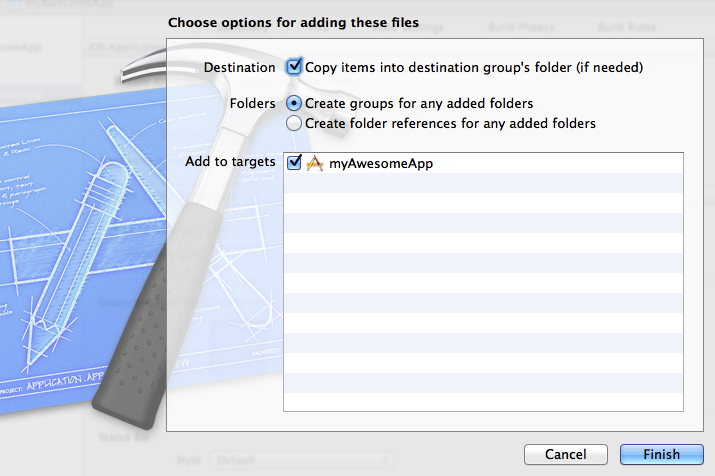

# PhoneGap Plug-in{#phonegap-plug-in}

This plug-in lets you send iOS AppMeasurement calls from your PhoneGap project.

To create a PhoneGap project, see [PhoneGap Getting Started with iOS](https://docs.phonegap.com/getting-started/).

This section contains the following information:

* [Install the plug-in using npm:](../phonegap/phonegap.md#section_43229E57C16944C0B51531CB92089189) 
* [Manually install the plug-in](../phonegap/phonegap.md#section_D53BA60D488C4DB8AD2BDF90439C180A) 
* [Implement Custom Tracking](../phonegap/phonegap.md#section_FD102B3CDAA4492FB04E56BF17E28663)

## Installing the plug-in using npm: {#section_43229E57C16944C0B51531CB92089189}

1. Run the following command: 

   ```
   cordova plugin add adobe-mobile-services
   ```

## Manually installing the plug-in {#section_D53BA60D488C4DB8AD2BDF90439C180A}

**Include the AppMeasurement Library**

To include the AppMeasurement:

1. Drag [!DNL ADBMobile_PhoneGap.h] and  [!DNL ADBMobile_PhoneGap.m] into the **[!UICONTROL Plugins]** folder in your Xcode project. 
1. Complete the following settings:

    1. Select **[!UICONTROL Copy items into destination group's folder (if needed)]**. 
    1. Select the targets where you want to use AppMeasurement code.

1. Drag [!DNL ADB_Helper.js] into the `www` folder in your project. 
1. In the [!DNL res/xml] folder, open [!DNL config.xml] and register an new plugin by adding the following: 

   ```
   <feature name="ADBMobile_PhoneGap"> 
     <param name="ios-package" value="ADBMobile_PhoneGap" /> 
   </feature>
   ```

**Add App Permissions**

The AppMeasurement library requires the following:

1. Launch the Xcode IDE and open your app. 
1. Drag the **[!UICONTROL AdobeMobile]** folder into your Xcode project and complete the following settings:

    1. Select **[!UICONTROL Copy items into destination group's folder (if needed)]**. 
    1. Select **[!UICONTROL Create groups for any added folders]**. 
    1. Select the targets where you want to use AppMeasurement code and click **[!UICONTROL Finish]**.

   {width="672"}

1. In the **[!UICONTROL Build Phases]** tab of your project’s target, expand the **[!UICONTROL Link Binary with Libraries]** section and add the following libraries:

    * [!DNL libsqlite3.dylib] 
    * [!DNL SystemConfiguration.framework]

1. Confirm that your app builds without unexpected errors.

## Implement Custom Tracking {#section_FD102B3CDAA4492FB04E56BF17E28663}

In `html` files where you want to use tracking, add the following to the `<head>` tag:

```
<script type="text/javascript" charset="utf-8" src="ADB_Helper.js"></script>
```

