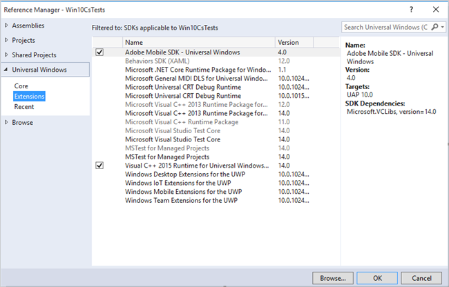

# Windows Visual Studio extensions for Experience Cloud Solutions 4.x SDK {#windows-visual-studio-extensions-for-experience-cloud-solutions-x-sdk}

This extension provides a much easier way to add the reference of the Experience Cloud Solutions 4.x Windows SDK in your project.

## Install the library from GitHub {#section_F55DB6241EF1475286C05FEAEBF996A3}

1. Download the Windows Universal SDK from [GitHub](https://github.com/Adobe-Marketing-Cloud/mobile-services/releases). 
1. Unzip the downloaded file locally. 
1. Double-click the **[!UICONTROL ADBMobileUniversalWindowsVSIX.vsix]** file to open the installer. 
1. Select **[!UICONTROL Global Location]** and install the library.

## Add references to your project {#section_00C14FE9243D4330BE1F4BB56FCF08B1}

1. Open your Windows 10 project. 
1. Open the Reference Manager dialogue box.

   

1. On the **[!UICONTROL Extensions]** tab, locate and select **[!UICONTROL Adobe Mobile SDK]**. 
1. Click **[!UICONTROL OK]** to save it.

   The Adobe Mobile SDK will be added to your project. If the **[!UICONTROL Microsoft Visual C++ Runtime]** package has not yet been added, this package will also be added to your project. 

1. In the Configuration Manager, select a a platform type and begin testing your app.
