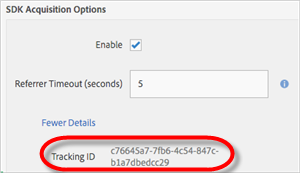

# Create Acquisition Link Manually{#create-acquisition-link-manually}

You can create marketing links to acquire new mobile app users on-the-fly by manually configuring the URL parameters.

>[!IMPORTANT]
>
>This feature requires SDK version 4.6 or later. For more information, see [Acquisition Prerequisites](../../acquisition-main/c-acquisition-prerequisites.md#concept_1395BCF2199642E7B653928E1A15AD19).

The following diagram illustrates the components of a manually built tracking link and displays the different URL parameters that you must properly configure when manually creating acquisition links.

This link is configured to perform a platform-specific redirect to the Google Play store or the Apple App Store for a mobile app. If the destination cannot be determined, the default store has been set to the Apple App Store. After the app has been installed, the `my.custom.key:test` custom context key is attached to the Analytics Install Hit.

To manually create links, use the following URL format:

[!DNL http(s)://c00.adobe.com/v3/ {mobile-services-app-hash}/start? {parameters}]

>[!TIP]
>
>The version of Android SDK you are using has no impact on this process.

For iOS, ensure that you use the correct protocol:

* Use **HTTP** if you are using the iOS SDKs older than version 4.7.0, or if you are using iOS SDK 4.7.0 or later *and* **[!UICONTROL Use HTTPS]** is **not** selected on the [!DNL Manage App Settings] page. 
* Use **HTTPS** if you are using iOS SDK 4.7.0 or later and **[!UICONTROL Use HTTPS]** **is** selected on the [!DNL Manage App Settings] page.

Where the following conditions have been met:

* `{mobile-services-app-hash}` matches the application identifier in the configuration file [!DNL (acquisition:appid]).

  You can locate `{mobile-services-app-has}` in the [!DNL Manage App Settings] page under [!DNL Acquisition SDK Options] in the [!DNL Tracking ID] field.

  

* [!DNL {parameters}] is a list of standard specifically named URL query parameters.

Here is the list of parameters:  

<table id="table_2C4F195B8271476885DFA226C81051B6"> 
 <thead> 
  <tr> 
   <th colname="col1" class="entry"> URL Parameter </th> 
   <th colname="col2" class="entry"> Description </th> 
   <th colname="col3" class="entry"> Example Value </th> 
  </tr>
 </thead>
 <tbody> 
  <tr> 
   <td> 
a_g_id 
 </td> 
   <td> 
Google Play Store App Identifier 
 </td> 
   <td> 
com.adobe.beardcons 
 </td> 
  </tr> 
  <tr> 
   <td> 
a_g_lo 
 </td> 
   <td> 
Google Play Store Locale Override 
 </td> 
   <td> 
ko 
 </td> 
  </tr> 
  <tr> 
   <td> 
a_i_id 
 </td> 
   <td> 
iTunes App Identifier 
 </td> 
   <td> 
835196493 
 </td> 
  </tr> 
  <tr> 
   <td> 
a_i_lo 
 </td> 
   <td> 
iTunes Locale Override 
 </td> 
   <td> 
jp 
 </td> 
  </tr> 
  <tr> 
   <td> 
a_dd 
 </td> 
   <td> 
Default Store for Auto Redirect 
 </td> 
   <td> 
i | g 
 </td> 
  </tr> 
  <tr> 
   <td> 
a_cid 
 </td> 
   <td> 
Custom ID Override (generally IDFA for iOS or ADID for Android) 
 </td> 
   <td> 
Any String &lt; 255 characters (UTF-8 encoded) 
 </td> 
  </tr> 
  <tr> 
   <td> 
ctx* 
 </td> 
   <td> 
Keys prefixed with ctx will end up in Context Data of the resulting launch hit 
 </td> 
   <td> 
ctxmy.custom.key=myValue 
 </td> 
  </tr> 
  <tr> 
   <td> 
ctxa.referrer.campaign.name 
 </td> 
   <td> 
Acquisition Campaign Name 
 
This parameter is required for reporting if you want to compare the performance of different acquisition links. 
 </td> 
   <td> 
2015 Summit Conference 
 </td> 
  </tr> 
  <tr> 
   <td> 
ctxa.referrer.campaign.trackingcode 
 </td> 
   <td> 
Tracking Code 
 
This parameter is required for reporting if you want to compare the performance of different acquisition links. 
 </td> 
   <td> 
lexsxouj 
 </td> 
  </tr> 
  <tr> 
   <td> 
ctxa.referrer.campaign.source 
 </td> 
   <td> 
Source 
 </td> 
   <td> 
Ad Network 
 </td> 
  </tr> 
  <tr> 
   <td> 
ctxa.referrer.campaign.medium 
 </td> 
   <td> 
Medium 
 </td> 
   <td> 
Email 
 </td> 
  </tr> 
  <tr> 
   <td> 
ctxa.referrer.campaign.content 
 </td> 
   <td> 
Content 
 </td> 
   <td> 
Image # 325689 
 </td> 
  </tr> 
  <tr> 
   <td> 
ctxa.referrer.campaign.term 
 </td> 
   <td> 
Term 
 </td> 
   <td> 
hiking+boots 
 </td> 
  </tr> 
 </tbody> 
</table>

When you manually create acquisition links, remember the following information:

* All parameters that do not match parameters in the table are passed on as part of the app store redirect. 
* All parameters are technically optional, although the link will be nonfunctional, if at least one store ID is specified.

  An example of a store ID is `a_g_id`/ `a_i_id`. 

* If the destination store cannot be automatically determined, and no default is provided, an 404 error is returned.

