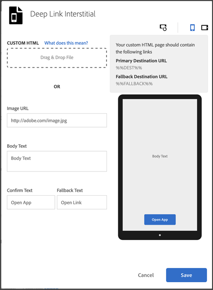

# Interstitials{#interstitials}

You can route users to a destination depending on whether they have the app installed (an app deep link) or not installed (to a website or an app store).

The choice of routing is best left to users. Marketers can provide user choices by configuring an interstitial page that shows users the available landing destinations.

To configure an interstitial when creating a marketing link:

1. Click **[!UICONTROL Edit Deep Link Interstitial]**.

   

1. Type information in the following fields:

    <table id="table_7085BFEFFF454F2CB6E355A85595E0B0"> 
    <thead> 
      <tr> 
      <th colname="col1" class="entry"> Field </th> 
      <th colname="col2" class="entry"> Description </th> 
      </tr>
    </thead>
    <tbody> 
      <tr> 
      <td colname="col1"> 
 Custom HTML 
 </td> 
      <td colname="col2"> 
 Select your custom interstitial HTML page. Custom interstitials is the ability for marketers to customize interstitial landing pages with custom HTML/CSS/JS, which allows you to brand your pages. 
 
Here are the requirements for the HTML page: 
        <ul id="ul_BE51B1E694464879955A24FBD1AAE07D"> 
          <li id="li_C4AD1C1598A349F8B8CC4224A45EFB97">Must be an HTML file. </li> 
          <li id="li_A9149F70FB2C49ACB0AA7B29E23E966C">Must contain the  %%DEST%% and  %%FALLBACK%% placeholders. </li> 
          <li id="li_C4296F798D304A7ABDA6DB015D01505F">The uploaded HTML will be served in an  &lt;iframe&gt;. 
You must ensure that your link targets are pointing to a parent window. You may include  &lt;base target="_parent" /&gt; in  &lt;head&gt; or specify a target property for each  &lt;a/&gt; individually. 
 </li> 
        </ul> 
 
 
Tip:  If you upload custom HTML, the other four options in this table will not be used unless you remove the uploaded file. 
 
 </td> 
      </tr> 
      <tr> 
      <td colname="col1"> 
 Image URL 
 </td> 
      <td colname="col2"> 
Specify the URL to an image asset. 
 </td> 
      </tr> 
      <tr> 
      <td colname="col1"> 
 Body Text  
 </td> 
      <td colname="col2"> 
Specify the body text for the interstitial. 
 </td> 
      </tr> 
      <tr> 
      <td colname="col1"> 
 Confirm Text  
 </td> 
      <td colname="col2"> 
Specify the text for the text button. 
 </td> 
      </tr> 
      <tr> 
      <td colname="col1"> 
 Fallback Text  
 </td> 
      <td colname="col2"> 
Specify the fallback text to display. 
 
This field updates the text button if a deep link fails. Users are directed to try the deep link before allowing them to fall back to another option. 
 
For example, a fallback could be to an app store to download and install the app or take users to the company's website. The fallback text lets users know that there is another option available if the deep link fails. 
 </td> 
      </tr> 
    </tbody> 
    </table>

1. (Optional) Click the icons above the image to see how the interstitial looks rotated and on different devices.

   You can change or edit the image outside [!DNL Mobile Services] to ensure that the image displays properly in different situations.
1. Click **[!UICONTROL Save]**.
