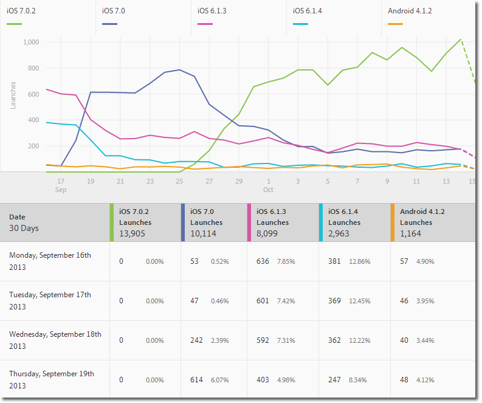
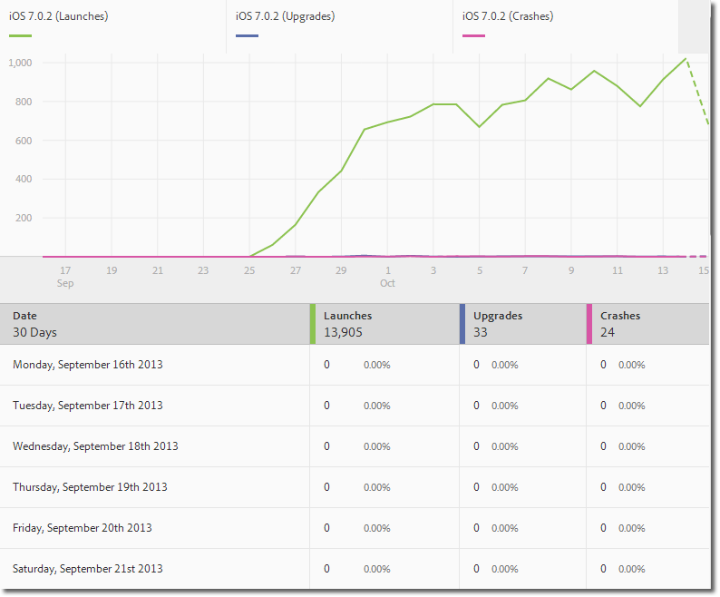

# Report Types {#report-types}

When customizing reports, the broad flexibility might create some questions as to the type of report that is best suited to get the data that you need.

 Before customizing reports, you must understand the difference between a metric and a dimension.

* Metric

  A metric is used to measure your data. Metrics are values that can be counted and added and are used to see how often specific actions occur in your app. Common metrics include installs, launches, revenue, lifetime value, and logins. For example, each time your app is launched, the _launches_value is increased by one.

* Dimension

  A dimension is used to describe your data. Dimensions are represented by using a string, or a number that acts like a string (such as a postal code, and is used to organize and segment your data. Examples of common dimensions include OS version, campaign name, product name, and mobile carrier. Each dimension has a number of specific values that are associated with that dimension. For example, the OS version dimension has values such as _iOS 7_ and _Android 4.1.2_.

Here are the types of reports that you can generate in the Mobile UI:

## Over-Time Report {#section_2741DA54C90C49AFB17C7B9BC7AD627D}

Over-time reports show how metrics are performing over a time range so you can quickly identify spikes and trends. Analysis often starts in an over-time report and moves into trended and ranked reports as you drill down to investigate the factors that might be contributing to a metric spike or trend.

For example, if you see a spike in launches, you might run a trended report that shows launches for the top 5 operating systems to see which operating systems are contributing most to the spike in launches:

To view dimension values with other metrics on an over-time report, you can use the instances metric and define a dimension filter.

## Trended Report {#section_C9BE9A2EDBFF4D938B9AF14C8AA67883}

Trended reports help you see how your most popular dimensions are performing against a metric. You can use this report to determine which values are contributing most to a change in a metric.

To view a trended report for a dimension, add a sticky filter (for example, Operating System = iOS 6.0.1) to an over-time report to view the same data. As a bonus, you can add five additional metrics to the filtered over-time report.

## Filtered Over-Time Report {#section_F8FAF2A4496F449CA99EF1E052C71A2D}

If you have a specific dimension value that you want to view, you can add a sticky filter to an over-time report. The following report shows 30 days' worth of launches, upgrades, and crashes for a specific operating system version.

## Ranked Report {#section_C073D744A95843AF99EE74FB5B013735}

Ranked reports show you how often the top 50 dimension contribute to a metric. This report is useful to view total contribution for a date range across a large number of values.

## Sunburst Report {#section_17A9842039174DE094A6B1E9837E35BB}

Sunburst reports provide, for example, the base report along with breakdowns. The visualization uses height to show the metric and the performance differences between the metrics. Each concentric circle represents an audience segment in the category for that circle. You can take actions on an audience, such as applying a Sticky Filter, hiding a metric, and viewing metrics.

You can view the report an in-product tutorial that describes how to interact with a sunburst chart.

To start the tutorial:

1. in Manage App Settings, click **[!UICONTROL Usage]**.

1. Click **[!UICONTROL Technology]** > **[!UICONTROL Technology Breakdown]**.
1. In the title bar of the report, click **[!UICONTROL Customize]**, and click the information icon.

### Pathing Report {#section_AD400106BC684B50B27CCCD3F4497114}

A Pathing report is based on path analysis and displays a pathing chart that represents paths that are taken from one state in the app to another state.

Each node is shaped like a box and represents a state in the users' paths though an app. For example, in the illustration above, the top node represents the number of users that launched the app and selected a photo from the gallery.

### Funnel Report {#section_AF3B0C899D844FC3AD1F91A2C452C92F}

Funnel reports allow you to identify where customers abandon a marketing campaign or divert from a defined conversion path while interacting with your mobile app. You can also use the Funnel report to compare the actions of different segments.

The funnel visualization lets you see where customers fall out of the process. Gaining visibility into customer decisions at each step helps you understand where customers are being deterred, what path they tend to follow, and when they leave your app.

