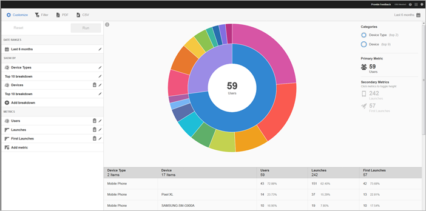

# Technology

This report provides a sunburst visualization for your existing data, and you can use the report to discover audience segments (collections of visitors) for targeting. Creating and managing audiences is similar to creating and using segments, except that you can make the audiences available in the [!DNL  Experience Cloud]. 

This section contains the following information: 

* [ Navigation and Usage](../usage/reports_technology.md#section_83CA60E1AE6245FEBCBFF3205615C4DF)
* [ Add Breakdowns and Metrics](../usage/reports_technology.md#section_15833511E82648869E7B1EFC24EF7B82)
* [ Create Sticky Filter](../usage/reports_technology.md#section_B4E355CD1FE34E4C8ADC38139ED67FC8)
* [ Share Reports](../usage/reports_technology.md#section_560DD5CED5144249B7E49461E2422100)

## Navigation and Usage {#section_83CA60E1AE6245FEBCBFF3205615C4DF}

This visualization provides, for example, the base report and breakdowns, uses height to show the metric in focus, and the performance differences between the metrics. Each ring represents an audience segment in the ring's category. You can take actions on an audience, such as applying a sticky filter, hiding a metric, and viewing metrics. 

>[!TIP]
>
>In addition to this information, you can view an in-product tutorial that describes how to interact with the sunburst chart. To start the tutorial, click **[!UICONTROL  Technology Breakdown]** in the title bar of the report, click **[!UICONTROL  Customize]**, and click the **[!UICONTROL  i]** icon. 

 

The sunburst chart is interactive, and you can complete the following tasks: 

* Mouse over the any part of the chart to display more information.
* Change the time period by clicking the **[!UICONTROL  Calendar]** icon.
* Click a slice in the ring to select the audience on which you can perform actions, such as zooming in, hiding audiences, creating in-app message, or a sticky filter.
* In the top right corner, select **[!UICONTROL  Device Type]** and **[!UICONTROL  Device]** to view information about devices and device types.
* Click a secondary metric on the right side to add it to the visualization. You can show the secondary metric using color, height, or both. 

The following table describes the standard reports and how they are populated in [!DNL  Mobile Services]: 

<table id="table_99DDCAE4993C4C579842D4CE4FC57555"> 
 <thead> 
  <tr> 
   <th colname="col1" class="entry"> Report </th> 
   <th colname="col2" class="entry"> Population Method </th> 
   <th colname="col3" class="entry"> Description </th> 
  </tr> 
 </thead>
 <tbody> 
  <tr> 
   <td colname="col1"> Device </td> 
   <td colname="col2"> Lifecycle metrics. </td> 
   <td colname="col3"> Common metrics broken down by device type. </td> 
  </tr> 
  <tr> 
   <td colname="col1"> Operating Systems </td> 
   <td colname="col2"> Automatic. </td> 
   <td colname="col3"> Common metrics broken down by operating system. </td> 
  </tr> 
  <tr> 
   <td colname="col1"> Operating System Version </td> 
   <td colname="col2"> Lifecycle metrics. </td> 
   <td colname="col3"> Common metrics broken down by operating system version. </td> 
  </tr> 
  <tr> 
   <td colname="col1"> Carriers </td> 
   <td colname="col2"> Automatic. </td> 
   <td colname="col3"> 
Common metrics broken down by carriers. 
 
Note: Wi-Fi users are reported as  (none) on this report. 
 </td> 
  </tr> 
 </tbody> 
</table>

## Add Breakdowns and Metrics {#section_15833511E82648869E7B1EFC24EF7B82}

You can add breakdowns and secondary metrics, which change the height of each audience relative to the other audiences in the chart. 

>[!IMPORTANT]
>
>The more rings you add to the sunburst, the longer it takes to process.

To add breakdowns and secondary metrics, click **[!UICONTROL  Technology Breakdown]** in the title bar of the report and click **[!UICONTROL  Customize]**. 

When you click **[!UICONTROL  Add Breakdown]** or **[!UICONTROL  Add Metric]**, a new item displays with the same name as the previous item in the list. Click the newly created breakdown or metric to access a drop-down list from which you can select a new item. 

## Create Sticky Filter {#section_B4E355CD1FE34E4C8ADC38139ED67FC8}

Click a slice in the ring to select the audience for which you want to create a sticky filter and click **[!UICONTROL  Sticky Filter]**. This filter allows you apply the current filters and run a new report based on the filters. 

## Share Reports {#section_560DD5CED5144249B7E49461E2422100}

After you create a report, your settings are used to create a custom URL that you can copy and share. 
