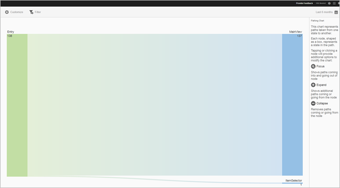
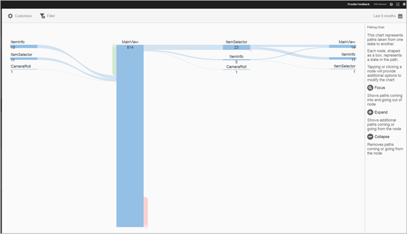

# View Paths

>[!TIP]
>
>The **[!UICONTROL  View Paths]** and **[!UICONTROL  View Action]** reports are similar because both are pathing reports. The **[!UICONTROL  View Paths]** report allows you to see how users navigate in your app from one screen to the next. The **[!UICONTROL  View Actions]** report displays the sequence of actions (events, such as clicks, selections, resizing, and so on) that users perform in your app. You can use a [ funnel report](../usage/reports_funnel.md#concept_7FA67283442D428FA444B0706083F67E) to combine navigation and actions in one report. 

 

Each node, shaped like a box, represents a state in the users' paths though an app. For example, in the illustration above, the top node represents the number of users that launched the app and navigated to the main view. 

When you click a node to provide the additional options to modify the chart, additional options such as **[!UICONTROL  Focus]** or **[!UICONTROL  Expand]** appear. For example, when you click the **[!UICONTROL  MainView]** state in the top node, the **[!UICONTROL  Focus]** and **[!UICONTROL  Expand]** icons appear. 

To expand the view, click the **[!UICONTROL  +]** icon to display the additional paths that come in to or go from the node. In the illustration below, state 1 is launching the app, state 2 is viewing the main page of the app, and state 3 includes the following paths that users took: 

* Navigating to the camera roll
* navigating to the item selector
* navigating to the camera
* navigating to the item info page

 

Click   to isolate the node and to show the paths that are coming into and going out of the selected node. In the illustration below, the following paths preceded users who were viewing the main view of the app: 

* item info
* item selector
* Camera roll
* Camera

 

You can focus or expand multiple nodes for a detailed view of the paths that users take in your app. For example: 

 

You can configure the following options for this report: 

<table id="table_1F79804A6A0240A98CB73A6EBE7F1068"> 
 <thead> 
  <tr> 
   <th colname="col1" class="entry"> Option </th> 
   <th colname="col2" class="entry"> Description </th> 
  </tr>
 </thead>
 <tbody> 
  <tr> 
   <td colname="col1"> 
 Time Period 
 </td> 
   <td colname="col2"> 
Click the  Calendar icon to select a custom period or to select a preset time period from the drop-down list. 
 </td> 
  </tr> 
  <tr> 
   <td colname="col1"> 
 Customize 
 </td> 
   <td colname="col2"> 
Customize your reports by changing the  Show By options, adding metrics and filters, and adding additional series (metrics), and more 
 
For more information, see <a href="../usage/reports_customize/reports_customize.md#concept_ED099E16594044E69FFD91829F436907" format="dita" scope="local"> Customize Reports</a> 
 </td> 
  </tr> 
  <tr> 
   <td colname="col1"> 
 Filter 
 </td> 
   <td colname="col2"> 
Click  Filter to create a filter that spans different reports to see how a segment is performing across all mobile reports. A sticky filter allows you to define a filter that is applied to all non-pathing reports. 
 
For more information, see <a href="../usage/reports_customize/t_sticky_filter.md#task_75B0AD4D58014BB0A5A09FE1B074ECE1" format="dita" scope="local"> Add Sticky Filter</a>. 
 </td> 
  </tr> 
  <tr> 
   <td colname="col1"> 
 Download 
 </td> 
   <td colname="col2"> 
Click  PDF or  CSV to download or open documents and share with users who do not have access to Mobile Services or to use it in presentations. 
 </td> 
  </tr> 
 </tbody> 
</table>

