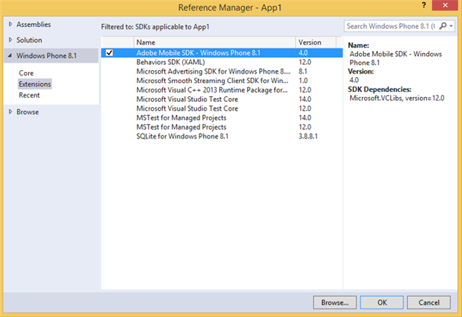

# Windows Visual Studio extensions for Experience Cloud Solutions 4.x SDK{#windows-visual-studio-extensions-for-experience-cloud-solutions-x-sdk}

This Extensions provides you a much easier way to add the reference of Experience Cloud Solutions 4.x Windows SDK in you project.

## Install from GitHub {#section_F55DB6241EF1475286C05FEAEBF996A3}

1. Download the Windows Universal SDK from [GitHub](https://github.com/Adobe-Marketing-Cloud/mobile-services/releases). 
1. Unzip the downloaded file locally. 
1. Double-click [!DNL ADBMobileWindowsStoreVSIX.vsix] or [!DNL ADBMobileWindowsPhoneVSIX.vsix] to open the installer. 

1. Select **[!UICONTROL Global Location]**, and then install the lib.

## Add References to Your Project {#section_00C14FE9243D4330BE1F4BB56FCF08B1}

1. Open your Windows 8.1 or Windows Phone 8.1 project. 
1. Open the dialogue of Reference Manager.

   

1. In the Extensions tab of Windows 8.1 or Windows Phone 8.1, locate Adobe Mobile SDK, then select it. 
1. Click **[!UICONTROL OK]** to save it.

   The Adobe Mobile SDK will be added to your project, together with Microsoft Visual C++ Runtime Package if it has not been added previously. 

1. Choose a Platform type in the Configuration Manager, then begin testing your app.

